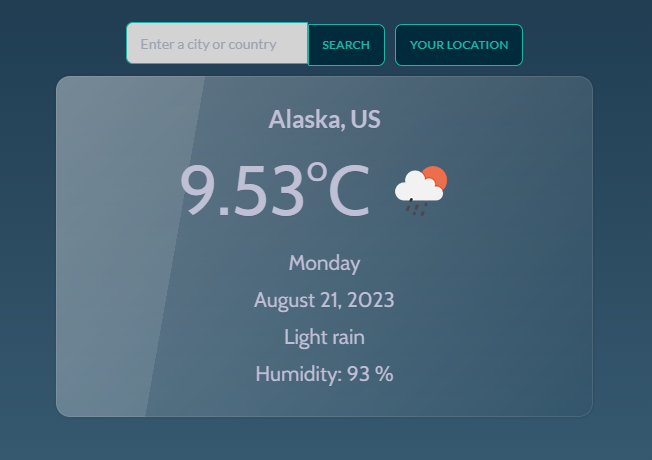

# React Weather Web App



A simple weather web app built with React, consuming data from the OpenWeatherMap API. It utilizes Tailwind CSS, DaisyUI, and Semantic UI for styling, and is built using Vite.

## Features

- Get current weather information based on city name, country and even some neighborhoods
- Display temperature, weather conditions, humidity, and more
- Responsive design for various screen sizes
- Stylish UI components using Tailwind CSS, DaisyUI, and Semantic UI
- Fast development and building using Vite

## Prerequisites

Before you begin, ensure you have the following tools installed:

- Node.js and npm (Node Package Manager)
- Git (optional)

## Getting Started

1. Clone the repository:

```bash
git clone https://github.com/mtlpks/react-weather-webapp.git
```

2. Navigate to the project directory:

```bash
cd react-weather-webapp
```

3. Install dependencies:

```bash
npm install
```

4. Obtain an API key from [OpenWeatherMap](https://openweathermap.org/api) by signing up for a free account.

5. Create a `.env` file in the project root and add your API key:

```env
REACT_APP_API_KEY=your_openweathermap_api_key
```

6. Start the development server:

```bash
npm run dev
```

Open your browser and go to `http://localhost:3000` to see the app in action!

## Usage

Enter a city name in the search bar, and the app will display the current weather information for that city.

## Styling

This app uses a combination of Tailwind CSS, DaisyUI, and Semantic UI for styling. You can customize the styles by editing the appropriate files in the `src` directory.

## Deployment

To build the app for production, run:

```bash
npm run build
```

The optimized and minified files will be generated in the `dist` directory. You can then deploy these files to your hosting platform of choice.

## Contributing

Contributions are welcome! Feel free to open an issue or submit a pull request for any enhancements or fixes.

## License

This project is licensed under the [MIT License](LICENSE).
